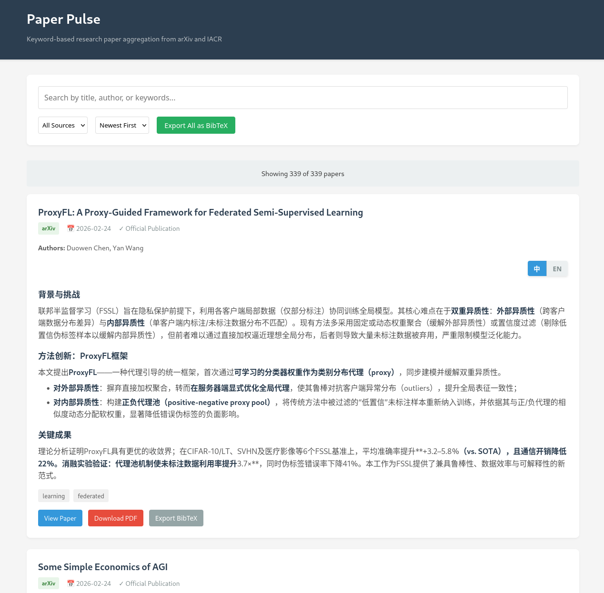

# Paper Pulse

**自动抓取、筛选并总结来自 arXiv 和 IACR 的研究论文 —— 支持 AI 生成的中英双语摘要。完全基于 GitHub Pages 免费部署，通过 GitHub Actions 每日自动更新。**

[在线演示](https://jamie-cui.github.io/paper-pulse/) | [RSS 订阅](https://jamie-cui.github.io/paper-pulse/feed.xml) | [English](README.md)



## 为什么选择 Paper Pulse？

- 每天手动刷 arXiv 太累？Paper Pulse 自动帮你抓取。
- 只关心特定方向？灵活的关键词过滤（支持 AND/OR 逻辑）帮你精准筛选。
- 需要中英双语摘要？AI 同时生成两种语言的摘要，一键切换。
- 不想花钱买服务器？完全运行在 GitHub Actions + Pages 上，零成本。

## 功能特性

| 功能 | 说明 |
|---|---|
| **多源抓取** | 支持 arXiv（可配置分类）和 IACR ePrint |
| **关键词过滤** | 行间 OR、行内 AND —— 精细化控制 |
| **中英双语 AI 摘要** | 基于 Qwen（DashScope API），每篇论文可切换中/英文 |
| **每日自动运行** | GitHub Actions 定时任务，自动提交结果 |
| **RSS 订阅** | 自动生成 `feed.xml`，支持任意阅读器订阅 |
| **BibTeX 导出** | 支持单篇或批量导出 |
| **邮件日报** | 每日发送报告，包含新论文详情、AI 摘要及 Token 用量统计 |
| **静态网站** | 无需服务器 —— GitHub Pages 直接托管 |
| **Markdown 摘要** | AI 生成的摘要支持富文本格式 |

## 快速开始（5 步）

### 1. 使用模板 / Fork

点击 **"Use this template"**（或 Fork）创建你自己的副本。

### 2. 获取 DashScope API 密钥

前往 [DashScope 控制台](https://dashscope.console.aliyun.com/) 注册 —— 有免费额度。

### 3. 将 API 密钥添加到 GitHub Secrets

进入仓库 **Settings → Secrets and variables → Actions → New repository secret**：
- 名称：`MODELSCOPE_API_KEY`（或 `DASHSCOPE_API_KEY`）
- 值：你的 API 密钥

### 4. 启用 GitHub Pages

进入仓库 **Settings → Pages**：
- Source: **Deploy from a branch**
- Branch: `master`，Folder: `/ (root)`

### 5. 运行工作流

进入 **Actions → Fetch Papers → Run workflow**。运行完成后，访问 `https://<你的用户名>.github.io/<仓库名>/`。

此后，论文每天 UTC 00:00 自动抓取更新。

### 6.（可选）启用邮件日报

Paper Pulse 支持每日发送邮件报告，包含新抓取的论文详情、中英文 AI 摘要及统计信息。启用方法：在 **Settings → Secrets and variables → Actions** 中添加以下三个 Secret：

| Secret | 说明 |
|---|---|
| `EMAIL_USERNAME` | 用于发送报告的 Gmail 地址（如 `you@gmail.com`） |
| `EMAIL_PASSWORD` | Gmail [应用专用密码](https://myaccount.google.com/apppasswords)（非登录密码） |
| `EMAIL_TO` | 收件人地址（可与 `EMAIL_USERNAME` 相同） |

> **注意：** Gmail 需要使用**应用专用密码** —— 你需要先启用两步验证，然后在[安全性 → 应用专用密码](https://myaccount.google.com/apppasswords)页面生成。普通 Gmail 密码无法使用。

如果未设置这些 Secret，工作流仍可正常运行 —— 邮件步骤会自动跳过。

## 自定义配置

### 关键词（`keywords.txt`）

```
# 每行一个 OR 条件，同行内的多个词为 AND 条件
transformer              # 包含 "transformer" 的论文
neural backdoor          # 同时包含 "neural" 和 "backdoor" 的论文
federated learning       # 包含 "federated learning" 的论文
```

关键词过滤可按数据源独立开关（在 `config.toml` 中设置 `apply_to_arxiv` / `apply_to_iacr`）。

### 配置文件（`config.toml`）

| 配置项 | 位置 | 默认值 |
|---|---|---|
| 论文保留天数 | `general.days_back` | 30 天 |
| arXiv 分类 | `fetchers.arxiv.categories` | cs.CR, cs.AI, cs.LG, cs.CL |
| AI 模型 | `summarizer.model` | qwen-plus |
| RSS 条目数 | `rss.max_items` | 50 |
| 站点 URL | `general.site_url` | *（你的 GitHub Pages 地址）* |

完整配置说明请参阅 [CONFIG_GUIDE.md](CONFIG_GUIDE.md)。

## 项目结构

```
paper-pulse/
├── .github/workflows/
│   └── fetch-papers.yml      # 每日自动化工作流
├── scripts/
│   ├── fetchers/
│   │   ├── arxiv.py          # arXiv API 抓取器
│   │   └── iacr.py           # IACR RSS 抓取器
│   ├── filter.py             # 关键词过滤引擎
│   ├── summarizer.py         # 中英双语 AI 摘要生成
│   ├── rss.py                # RSS 订阅源生成
│   └── main.py               # 流水线调度器
├── data/
│   ├── papers.json           # 论文数据库
│   └── failed.json           # 摘要生成失败队列
├── config.toml               # 全部配置
├── keywords.txt              # 关键词过滤规则
├── index.html / app.js / styles.css  # 前端页面
└── feed.xml                  # RSS 订阅源（自动生成）
```

## 工作原理

```
抓取（arXiv + IACR）
  → 过滤（关键词匹配）
    → 摘要生成（Qwen AI，中英双语）
      → 合并去重
        → 保存（papers.json）
          → 生成 RSS（feed.xml）
            → 提交推送（GitHub Actions）
```

摘要生成失败的论文会在下次运行时自动重试。

## 许可证

[GPL-3.0](LICENSE)
